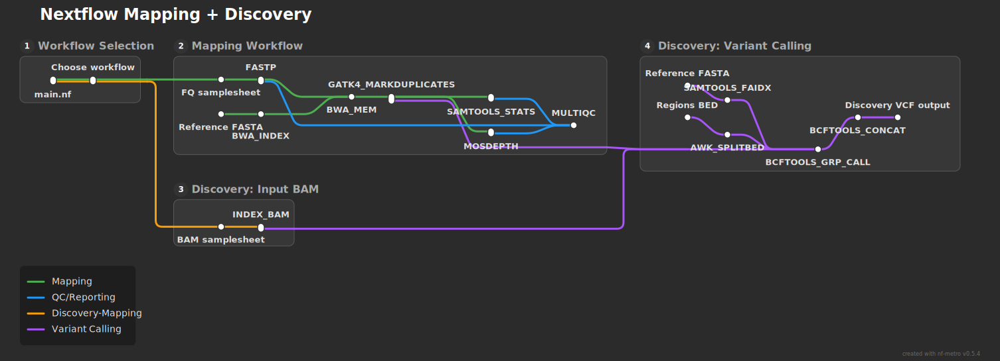

<h1> tetris-3d</h1>

**A rework of the tetris pipeline, like Duke3D for nf-tetris.**

`tetris-3d` processes whole-genome sequencing data from raw reads or pre-aligned BAM files. It performs read trimming/QC, aligns reads to a reference genome, optionally marks duplicates, and generates alignment and coverage QC outputs. In discovery mode, it also performs grouped variant calling across samples in user-defined genomic regions and produces combined VCF output for downstream interpretation.

## Overview

`tetris-3d` is a Nextflow DSL2 pipeline with two entry workflows:

- `mapping`: FASTQ to mapped BAM (+ QC and optional mark-duplicates)
- `discovery`: mapping (or provided BAMs) + grouped variant discovery

## Simplfied Pipeline Schematic



## Requirements

- Nextflow (DSL2)
- Docker (for `-profile local`) or AWS Batch/Seqera setup (for `-profile seqera`)

## Profiles

- `local`: local executor + Docker
- `seqera`: AWS Batch executor using values from `conf/aws_seqera.config`

## Running

You can choose workflow using `-entry`, `--workflow`, or boolean flags.

### Mapping

```bash
nextflow run main.nf \
  --workflow mapping \
  --samplesheet path/to/fastq_samplesheet.csv \
  --reference path/to/reference.fasta \
  -profile local
```

### Mapping with FASTQ splitting

```bash
nextflow run main.nf \
  --workflow mapping \
  --samplesheet path/to/fastq_samplesheet.csv \
  --reference path/to/reference.fasta \
  --split_lines 1000000 \
  -profile local -resume
```

### Discovery from FASTQ

```bash
nextflow run main.nf \
  --workflow discovery \
  --samplesheet path/to/fastq_samplesheet.csv \
  --reference path/to/reference.fasta \
  --regions path/to/regions.bed \
  -profile local
```

### Discovery from existing BAMs

```bash
nextflow run main.nf \
  --workflow discovery \
  --skip_mapping \
  --samplesheet path/to/bam_samplesheet.csv \
  --reference path/to/reference.fasta \
  --regions path/to/regions.bed \
  -profile local
```

## Testing and scaling runs

Use `--max_samples` to test a large cohort on a smaller subset first, then scale up with `-resume`.

Example staged approach:

```bash
# 1) Dry-run your settings on a small subset
nextflow run main.nf \
  --workflow mapping \
  --samplesheet path/to/fastq_samplesheet.csv \
  --reference path/to/reference.fasta \
  --max_samples 10 \
  -profile local

# 2) Scale to full cohort and reuse completed tasks
nextflow run main.nf \
  --workflow mapping \
  --samplesheet path/to/fastq_samplesheet.csv \
  --reference path/to/reference.fasta \
  -profile local -resume
```

`-resume` tells Nextflow to reuse cached results from prior runs (when inputs and parameters for a task are unchanged), which is useful for iterative tuning and recovery from interrupted runs.

## Inputs

### FASTQ samplesheet format

Header:

```csv
uuid,sample_name,seq_ID,resub_no,seq_centre,seq_date,read_type,fastq_1,fastq_2
```

### BAM samplesheet format (for `--skip_mapping`)

Header:

```csv
sample,bam
```

## Key parameters

- `--samplesheet`: input CSV
- `--reference`: reference FASTA
- `--regions`: BED regions (required for discovery)
- `--outdir`: output directory (default: `results`)
- `--split_lines`: FASTQ split size (default: `0`, disabled)
- `--skip_fastp`: skip read trimming
- `--skip_markdup`: skip duplicate marking
- `--max_samples`: process first N samples from CSV

## Outputs

Primary outputs are written under `--outdir`:

- `mapping/` BAM/BAM index outputs
- `multiqc_report/` MultiQC report (mapping workflow)
- `pipeline_info/` Nextflow run reports, timeline, trace, and DAG

